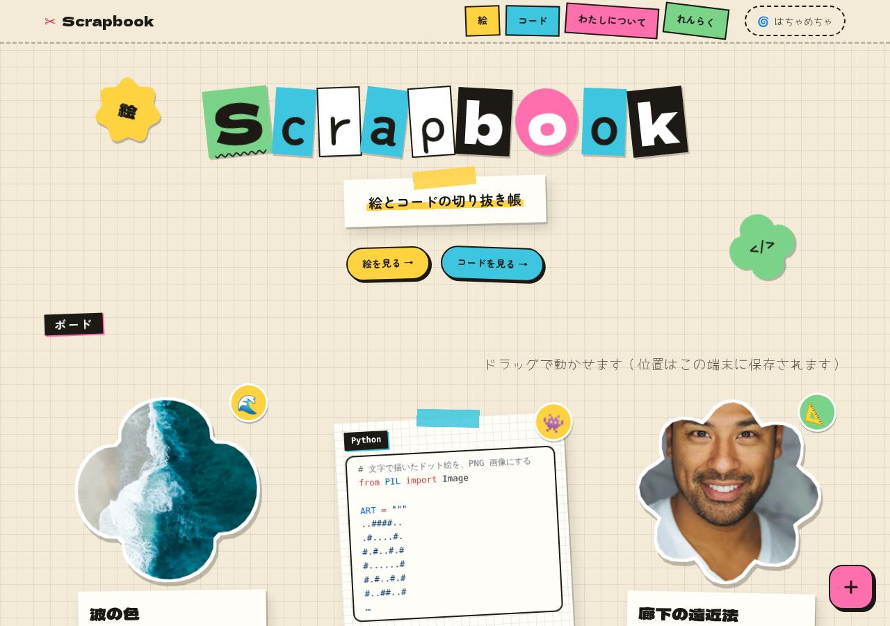
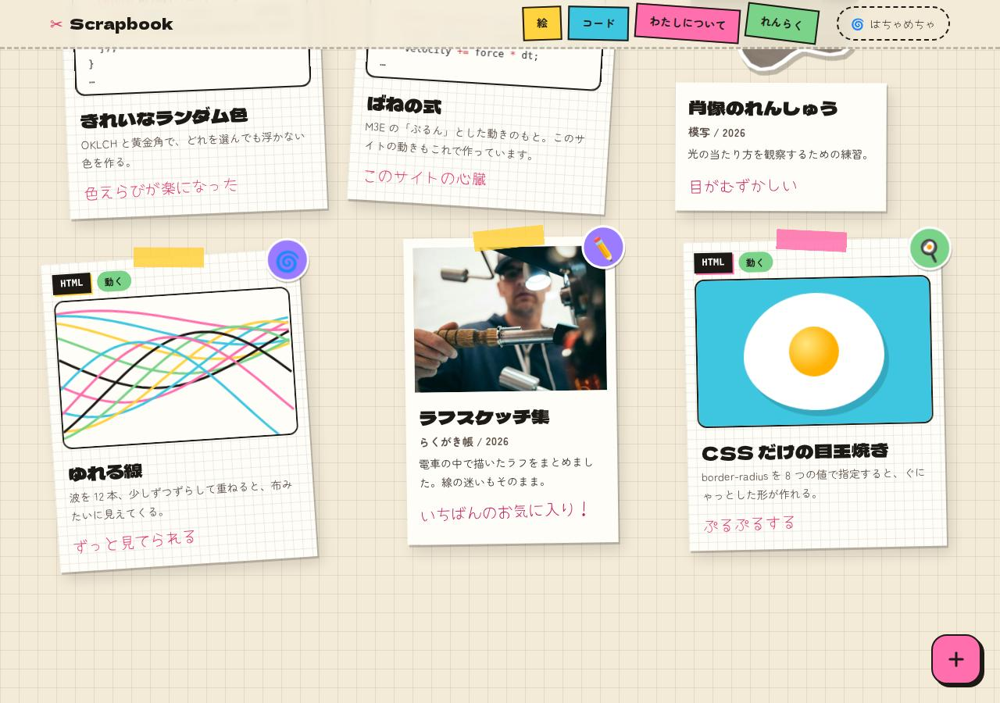
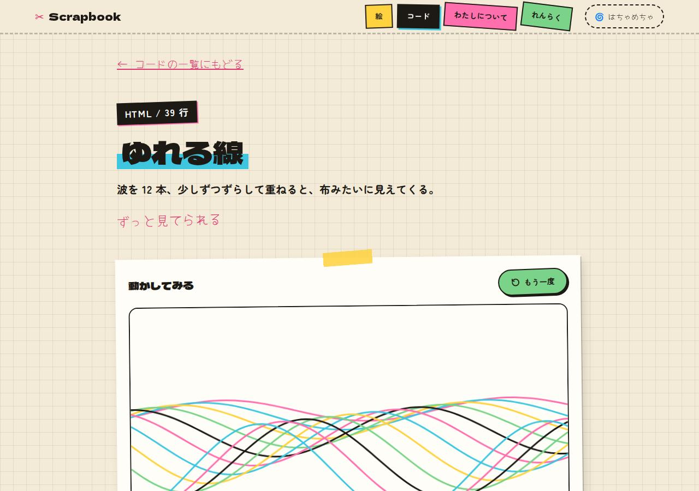
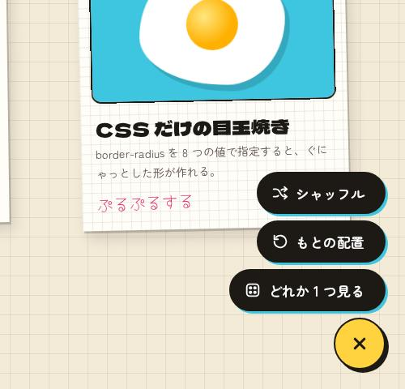
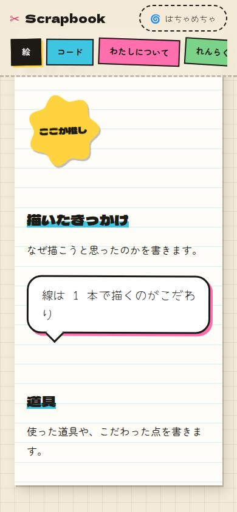

# Scrapbooks

絵とコードを集めた、スクラップブック風のポートフォリオです。[EmDash](https://github.com/emdash-cms/emdash)（Astro 製の CMS）の portfolio テンプレートをもとに作り替えました。Cloudflare Workers ＋ D1 ＋ R2 で動きます。

**方針：見た目ははちゃめちゃ、操作はまじめ。動きは M3E（Material 3 Expressive）、配置は自由。**



| ボード（絵とコードを自由に貼る） | 動くコード |
| --- | --- |
|  |  |

| FAB メニュー | 本文のステッカー（スマホ） |
| --- | --- |
|  |  |

## できること

| 機能 | 内容 |
| --- | --- |
| ボード | 表紙に絵とコードを混ぜて貼る。マウスでドラッグして好きな位置に動かせる（位置はこの端末に保存） |
| 位置を CMS で決める | 管理画面の「表紙での横位置・縦位置・傾き」で、最初の置き場所を決められる。空なら自動でばらまく |
| FAB メニュー | 右下のボタンから「シャッフル」「もとの配置」「どれか 1 つ見る」 |
| 絵 | ポラロイド、または M3E の形（クッキー・クローバー・お花・おひさま・丸）に切り抜いたシール |
| コード | 色つきで表示。HTML は「動かして見せる」をオンにすると、安全な枠の中で実際に動く。ワンクリックでコピー |
| ステッカーブロック | 本文の好きな場所に、シール・吹き出し・ラベルを貼れる（管理画面で「/」→「ステッカー」） |
| ページの移り変わり | カードの写真やコードが、詳細ページの同じものへ伸びるように動く（View Transitions） |

## M3E の動き

| 動き | どこで |
| --- | --- |
| ばね（行き過ぎて戻る） | カードのホバー、ドラッグを離したとき、シャッフル、FAB メニューが開くとき |
| 形の変形（シェイプモーフ） | ステッカーと切り抜きの絵にマウスを乗せると、別の形に変わる |
| ボタンの形 | 押している間は角が四角くなり、離すとばねで丸に戻る。コピーが終わるとアイコンが ✓ に変わる |
| FAB | 閉じているときは角の丸い四角、開くと丸になり、+ が × に回る |

ばねは実際のばねの式を数値計算して、CSS の `linear()` に置き換えています（`src/styles/theme.css` の `--m3e-*`）。

## 使いやすさのために守っていること

| 工夫 | 内容 |
| --- | --- |
| 整頓モード | 右上のボタンで、傾き・動き・自由配置を止めて、格子にまっすぐ並べる（Cookie に保存）。OS の「視差効果を減らす」設定でも動きは止まる |
| 並び順 | 自由配置でも、読み上げと Tab の順番は変わらない |
| スマホ | 1 列に並べる。ドラッグはしない（スクロールのじゃまをしないため） |
| 現在地 | 今いるページのメニューは黒いラベルになる |
| 押しやすさ | ボタン・リンクは高さ 44px 以上。カードは全体がリンク |
| 読みやすさ | 本文は白い紙の上、大きめの文字・広めの行間 |
| キーボード | 「本文へ移動」リンク、太い点線のフォーカス表示、FAB メニューは Esc で閉じる |
| 安全 | 動くコードは `sandbox="allow-scripts"` の枠の中だけで動き、サイト本体には触れない |

## ページ

| ページ | URL |
| --- | --- |
| 表紙（ボード） | `/` |
| 絵の一覧（タグで絞り込み） | `/work` |
| 絵の詳細 | `/work/:slug` |
| コードの一覧（タグで絞り込み） | `/code` |
| コードの詳細 | `/code/:slug` |
| わたしについて | `/about` |
| れんらく | `/contact` |
| RSS | `/rss.xml` |

## 手元で動かす

```bash
pnpm install
pnpm dev
```

1. http://localhost:4321/_emdash/admin を開いて初期設定をする（見本の絵とコードも一緒に入る）
   - 急ぐときは http://localhost:4321/_emdash/api/setup/dev-bypass?redirect=/_emdash/admin で初期設定を飛ばせる（開発中のみ）
2. 管理画面の「絵」「コード」で追加・編集する
3. http://localhost:4321 で確認する

## 自分用にするときに書き換えるところ

| 場所 | 内容 |
| --- | --- |
| 管理画面 → 設定 | サイト名・キャッチコピー |
| 管理画面 → 絵 ／ コード | 作品（見本は削除してよい） |
| 管理画面 → Pages → about | 自己紹介 |
| `src/pages/contact.astro` | 連絡先のメールアドレス（今は `hello@example.com`） |
| `src/pages/about.astro` | 横のふせんメモ（すきなこと） |

### 絵とコードの項目

| 項目 | 絵 | コード | 表示される場所 |
| --- | --- | --- | --- |
| 手書きメモ（`note`） | ○ | ○ | カードの下に手書き文字で |
| ステッカー（`sticker`） | ○ | ○ | カードの角に丸いシールで（絵文字 1 つ） |
| 枠の形（`frame`） | ○ | | ポラロイド、または切り抜きの形 |
| 言語（`language`）・コード（`code`） | | ○ | 色つきのコード |
| 動かして見せる（`runnable`） | | ○ | HTML のとき、安全な枠の中で動かす |
| 表紙での位置・傾き（`board_x` `board_y` `tilt`） | ○ | ○ | ボードの最初の置き場所 |

## 公開する

```bash
pnpm wrangler login
pnpm deploy
```

D1 データベース `scrapbooks` と R2 バケット `scrapbooks-media` は、初回のデプロイで作られます（`wrangler.jsonc`）。

Worker の大きさは、圧縮後でおよそ 4.6MB です（ほとんどが EmDash 本体）。Workers の無料プランの上限（3MB）を超えるので、公開には有料プラン（上限 10MB）が必要になる見込みです。
