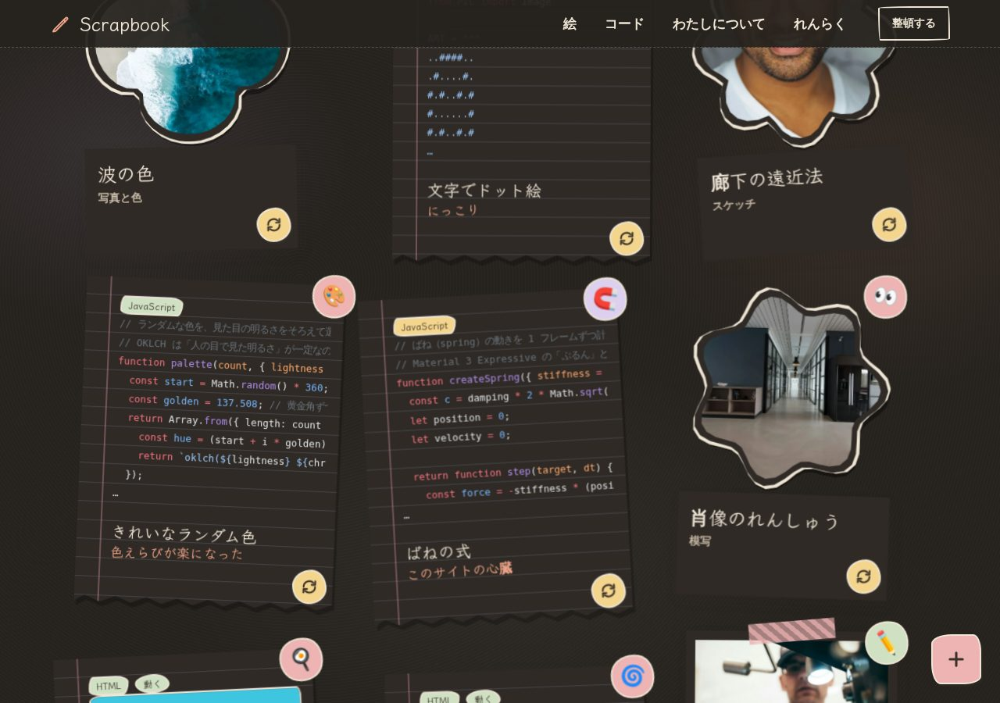

# Scrapbooks

絵とコードを集めた、スケッチブック風のポートフォリオです。[EmDash](https://github.com/emdash-cms/emdash)（Astro 製の CMS）の portfolio テンプレートをもとに作り替えました。Cloudflare Workers ＋ D1 ＋ R2 で動きます。

**方針：見た目はあたたかい手描き、操作はまじめ。動きは M3E（Material 3 Expressive）、配置は自由。**


| ボード（絵とコードを机の上に貼る） | 裏返したカードと FAB メニュー |
| --- | --- |
|  |  |

| 夜の配色 | 動くコード |
| --- | --- |
|  |  |

| 本文のステッカー（スマホ） |
| --- |
|  |

画像の作品は見本データ（Unsplash の写真）です。

## 見た目

| 部分 | 内容 |
| --- | --- |
| 紙 | 画用紙の色、上端のリング綴じ、水彩のにじみ。夜は暗い紙になる |
| 文字 | 見出しと手書きメモは Klee One 600（Web フォントはこれ 1 つだけ）。本文・ボタン・メニューは端末の日本語フォント |
| 絵のカード | 白いふちの写真を、写真コーナーかマスキングテープで留める。M3E の形（クッキー・クローバー・お花・おひさま・丸）に切り抜いた絵もある |
| コードのカード | 罫線ノートの切れ端。下が破れていて、左に赤い余白線がある |
| 部品 | 手描きの枠のボタン、クレヨン色、蛍光ペンの見出し、丸いシール、現在地を囲む赤ペンの丸 |

設計は [`docs/design/sketchbook-style.md`](docs/design/sketchbook-style.md) にあります。

## できること

| 機能 | 内容 |
| --- | --- |
| 3D の机 | 表紙のボードが机の上に置かれ、マウスの動きに合わせてゆるく傾く。カードの重なりは奥行きで表す |
| ドラッグ | カードを好きな位置へ動かせる（位置はこの端末に保存） |
| FAB メニュー | 右下のボタンから「シャッフル」「もとの配置」「どれか 1 つ見る」。管理者には「この並べ方を公開する」も出る |
| 裏返し | カードの角のボタンで裏返す。絵の裏は手書きメモと、あれば 2 枚目の絵。動くコードは表が動く様子、裏がコード。動かないコードの裏はひとこと説明 |
| 動くコード | HTML のコードを、安全な枠（`sandbox`）の中で実際に動かす。画面に見えている間だけ動き、見えなくなると止まる |
| 並べ方の公開 | 管理者が並べた位置を、CMS の `board_x` / `board_y` に書き込んで公開する（sandboxed プラグイン）。見る人には、その並びが最初の置き場所になる |
| ステッカーブロック | 本文の好きな場所に、シール・吹き出し・ラベルを貼れる（管理画面で「/」→「ステッカー」） |
| 整頓モード | 右上のボタンで、傾き・動き・自由配置を止めて、格子にまっすぐ並べる（Cookie に保存） |
| 昼・夜 | フッターで切り替える。「端末に合わせる」もある |
| 初期設定のロック | 公開したサイトの初期設定は、合言葉（`SETUP_KEY`）を知っている人だけが進められる |
| ページの移り変わり | カードの写真が、詳細ページの同じ写真へ伸びるように動く（View Transitions） |

## 動きの決まり

| 動き | どこで |
| --- | --- |
| ばね（行き過ぎて戻る） | カードのホバー、ドラッグを離したとき、シャッフル、FAB が開くとき |
| 形の変形（シェイプモーフ） | ステッカーと切り抜きの絵にマウスを乗せると、別の形に変わる |
| ボタンの形 | 押している間は角が変わり、離すとばねで戻る |

- 動かすのは `transform`・`opacity`・`translate`・`rotate`・`scale` だけ
- ばねは実際のばねの式を数値計算して、CSS の `linear()` に置き換えている（`src/styles/theme.css` の `--m3e-*`）
- 傾きと 3D の角度には `--wobble` を掛ける。整頓モードと「視差効果を減らす」設定では 0 になり、動きが止まる

## 使いやすさのために守っていること

| 工夫 | 内容 |
| --- | --- |
| 並び順 | 自由配置でも、読み上げと Tab の順番は HTML の順番のまま |
| スマホ | 1 列に並べる。ドラッグや 3D はしない（スクロールのじゃまをしないため）。メニューは 4 つとも 1 段に入る |
| 現在地 | 今いるページのメニューは、赤ペンの丸で囲まれ、`aria-current="page"` が付く |
| 押しやすさ | ボタン・リンクは高さ 44px 以上。カードは全体がリンク |
| キーボード | 「本文へ移動」リンク、太い点線のフォーカス、FAB は Esc で閉じる、裏返しは Enter |
| 飾り | ステッカー・らくがき・テープは読み上げの対象にしない（`aria-hidden`） |
| 安全 | 動くコードは `sandbox="allow-scripts"` の枠の中だけで動き、サイト本体には触れない |
| 速さ | 表紙の JS は約 7KB（gzip）。画面の外のカードの整形をあとにまわす（[性能の予算](docs/architecture/performance.md)） |

## ページ

| ページ | URL |
| --- | --- |
| 表紙（ボード） | `/` |
| 絵の一覧（タグで絞り込み） | `/work` |
| 絵の詳細 | `/work/:slug` |
| コードの一覧（タグで絞り込み） | `/code` |
| コードの詳細 | `/code/:slug` |
| わたしについて | `/about` |
| れんらく | `/contact` |
| RSS | `/rss.xml` |

## 手元で動かす

```bash
pnpm install
pnpm dev
```

1. http://127.0.0.1:4321/_emdash/admin を開いて初期設定をする（見本の絵とコードも一緒に入る）
   - 急ぐときは http://127.0.0.1:4321/_emdash/api/setup/dev-bypass?redirect=/ で初期設定を飛ばせる（開発中のみ）
2. 管理画面の「絵」「コード」で追加・編集する
3. http://127.0.0.1:4321 で確認する

| コマンド | すること |
| --- | --- |
| `pnpm verify` | 型チェック ＋ docs の形の確認 |
| `pnpm build` | 本番用のビルド |
| `pnpm perf` | 性能の予算を測る（`pnpm build` のあと `pnpm preview --host 127.0.0.1 --port 4322` で動かしておく） |
| `pnpm --dir plugins/board-layout test` | 並べ方の公開プラグインのテスト |

## 好きなものを読み込む

自分の写真と絵は、git に入れずに EmDash の API で読み込みます。`.private-media/`（gitignore）に画像と `favorites.json` を置いて、開発サーバーを動かしたまま次を実行します。

```bash
pnpm load:favorites
```

- 何度実行しても重複しない（同じ画像・同じ slug は使い回すか更新する）
- 見本の作品は下書きに戻る
- 本番へ入れるときは `pnpm load:favorites -- --url <サイト> --token <トークン>`
- 仕組みは [`docs/architecture/favorites.md`](docs/architecture/favorites.md)、置き場所の考え方は [`docs/decisions/private-media.md`](docs/decisions/private-media.md)

## 自分用にするときに書き換えるところ

| 場所 | 内容 |
| --- | --- |
| 管理画面 → 設定 | サイト名・キャッチコピー |
| 管理画面 → 絵 ／ コード | 作品（見本は削除してよい） |
| 管理画面 → Pages → about | 自己紹介と似顔絵 |
| `src/pages/contact.astro` | 連絡先のメールアドレス（今は `hello@example.com`） |
| `src/pages/about.astro` | 横のふせんメモ（すきなこと） |

### 絵とコードの項目

| 項目 | 絵 | コード | 表示される場所 |
| --- | --- | --- | --- |
| 手書きメモ（`note`） | ○ | ○ | カードの下に手書き文字で |
| ステッカー（`sticker`） | ○ | ○ | カードの角の丸いシールに（絵文字 1 つ） |
| 枠の形（`frame`） | ○ | | 白いふちの写真、または切り抜きの形 |
| 裏の絵（`back_image`） | ○ | | 裏返したときの 2 枚目の絵 |
| 言語（`language`）・コード（`code`） | | ○ | 色つきのコード |
| 動かして見せる（`runnable`） | | ○ | HTML のとき、安全な枠の中で動かす |
| 表紙での位置・傾き（`board_x` `board_y` `tilt`） | ○ | ○ | ボードの最初の置き場所 |

## 公開する

公開の手順は [`docs/guides/deploy.md`](docs/guides/deploy.md) にあります（D1・R2 の用意、Worker の出し方、合言葉、初期設定、好きなものの読み込み）。Worker は圧縮後でおよそ 4.7MB あり、Workers の無料プランの上限（3MB）を超えるので、有料プラン（上限 10MB）が必要です。

## ドキュメント

設計の資料は [`docs/index.md`](docs/index.md) から読めます。[Open Knowledge Format（OKF）v0.2](https://github.com/GoogleCloudPlatform/knowledge-catalog/blob/main/okf/SPEC.md) に沿って、1 つの概念を 1 ファイルで書いています。

| 分類 | 内容 |
| --- | --- |
| [product](docs/product/) | 何を作るか・誰のためか |
| [design](docs/design/) | 見た目・動き・3D の決まりごと |
| [architecture](docs/architecture/) | ボード・プラグイン・性能などの作り |
| [decisions](docs/decisions/) | 決めたことと理由、確認待ちの問い |
| [guides](docs/guides/) | 開発・公開の手順 |
| [tasks](docs/tasks/) | 作業の一覧と進み具合 |
