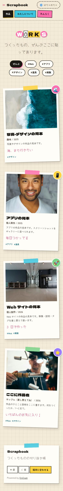

# Scrapbooks

スクラップブック風のポートフォリオです。[EmDash](https://github.com/emdash-cms/emdash)（Astro 製の CMS）の portfolio テンプレートをもとに、見た目をまるごと作り替えました。Cloudflare Workers ＋ D1 ＋ R2 で動きます。

**方針：見た目ははちゃめちゃ、操作はまじめ。**

| 表紙（PC） | 作品一覧（スマホ） |
| --- | --- |
|  |  |

## はちゃめちゃにしたところ

| パーツ | 見た目 |
| --- | --- |
| サイト名 | 1 文字ずつ切り抜いた脅迫状風の文字（`RansomTitle`） |
| 作品カード | テープで貼ったポラロイド写真。傾き・ステッカー付き |
| 背景 | 方眼ノート |
| メニュー | 色ちがいのラベルシール |
| 本文 | 罫線入りの紙、引用はふせん |
| 書体 | 見出し：Dela Gothic One ／ 本文：Zen Maru Gothic ／ 手書き：Yomogi |

## 使いやすさのために守っていること

| 工夫 | 内容 |
| --- | --- |
| 整頓モード | 右上のボタンで、傾きと動きを止めてまっすぐ並べ直す（Cookie に保存）。OS の「視差効果を減らす」設定でも自動で止まる |
| 現在地 | 今いるページのメニューは黒いラベルになる |
| 押しやすさ | ボタン・リンクは高さ 44px 以上。カードは全体がリンク |
| 読みやすさ | 本文は白い紙の上、大きめの文字・広めの行間。小さい文字には太い見出し書体を使わない |
| キーボード | 「本文へ移動」リンク、太い点線のフォーカス表示 |
| ホバー | カードにマウスやフォーカスを当てると、まっすぐに戻って少し浮く |
| スマホ | 1 列表示、傾きは半分、メニューは横スクロール |
| 配色 | 昼 ／ 夜 ／ 端末に合わせる、を切り替えられる |

## ページ

| ページ | URL |
| --- | --- |
| 表紙 | `/` |
| 作品一覧（タグで絞り込み） | `/work` |
| 作品の詳細 | `/work/:slug` |
| わたしについて | `/about` |
| れんらく | `/contact` |
| RSS | `/rss.xml` |

## 手元で動かす

```bash
pnpm install
pnpm dev
```

1. http://localhost:4321/_emdash/admin を開いて初期設定をする（見本の作品も一緒に入る）
   - 急ぐときは http://localhost:4321/_emdash/api/setup/dev-bypass?redirect=/_emdash/admin で初期設定を飛ばせる（開発中のみ）
2. 管理画面の「Projects」で作品を追加・編集する
3. http://localhost:4321 で確認する

## 自分用にするときに書き換えるところ

| 場所 | 内容 |
| --- | --- |
| 管理画面 → 設定 | サイト名・キャッチコピー |
| 管理画面 → Projects | 作品（見本 4 件は削除してよい） |
| 管理画面 → Pages → about | 自己紹介 |
| `src/pages/contact.astro` | 連絡先のメールアドレス（今は `hello@example.com`） |
| `src/pages/about.astro` | 横のふせんメモ（すきなこと） |

作品には、EmDash 標準の項目に加えて次の 2 つを足しています。

| 項目 | 表示される場所 |
| --- | --- |
| 手書きメモ（`note`） | 写真の下に手書き文字で出る |
| ステッカー（`sticker`） | 写真の角に丸いシールで出る（絵文字 1 つ） |

## デザインを変えるとき

- 色・影・傾きの強さは `src/styles/theme.css` の `:root` にまとめています
- 傾きはすべて `--wobble`（0〜1）を掛けています。`0` にするとまっすぐになります
- 書体は `astro.config.mjs` の `fonts` で変えられます

## 公開する

```bash
pnpm wrangler login
pnpm deploy
```

D1 データベース `scrapbooks` と R2 バケット `scrapbooks-media` は、初回のデプロイで作られます（`wrangler.jsonc`）。
