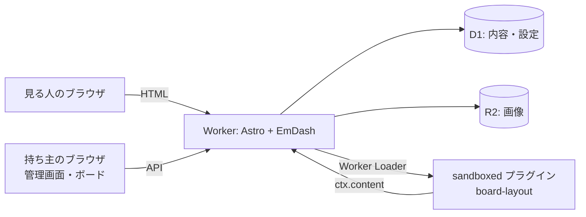

# 構成

| 部分 | 採用 | 場所 |
| --- | --- | --- |
| サイト | Astro 7（`output: "server"`）＋ EmDash 1.0 | `src/` |
| 実行 | Cloudflare Workers（有料プラン。Worker は圧縮前 64 MiB まで） | `wrangler.jsonc` |
| 内容 | D1（`DB`） | |
| 画像 | R2（`MEDIA`） | |
| プラグイン（信頼） | ステッカー（native） | `src/plugins/sticker/` |
| プラグイン（隔離） | 並べ方の公開（sandboxed、Worker Loader `LOADER`） | `plugins/board-layout/` |
| 非同期処理 | Effect（サーバー）・Micro（ブラウザ） | [effect](/architecture/effect.md) |

# コレクション

| コレクション | 中身 | URL |
| --- | --- | --- |
| `projects` | 絵 | `/work/:slug` |
| `snippets` | コード | `/code/:slug` |
| `pages` | 固定ページ | `/about` |

絵とコードは共通で `board_x`（0〜100 %）・`board_y`（px）・`tilt`（度）を持つ。ボードの初期位置になる。
